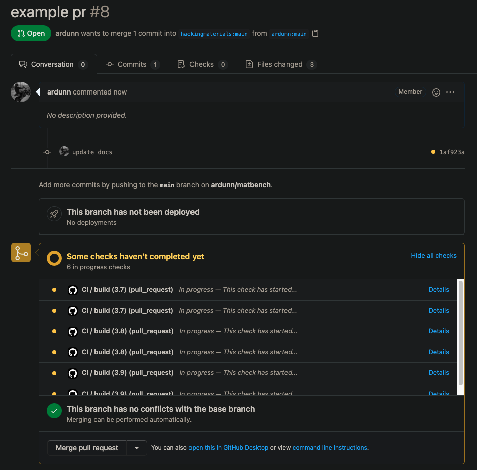

# 3 - Submit to leaderboard


## Step 1: Create 3 required files

To submit to the leaderboard, you need 3 files:

1. `results.json.gz`: The file you saved when [recording your data](2run.md). [Instructions on how to create this file](#resultsjsongz)
2. `info.json`: A short file of some metadata about your algorithm. [Instructions on how to create this file, with template](#infojson)
3. Either (a) an `.ipynb` notebook detailing your algorithm with code for running it, or (b) one or more `.py` files with source code for running/benchmarking your algorithm. [Instructions here](#source-files)


## Step 2: Put files in appropriate folder

- a. If you are using matbench through pypi, clone the source repository in order to make a pull request. Find instrucions for cloning the source repository on the [Installation page](1install.md).
- b. Locate the `matbench/benchmarks` directory.
- c. Create a new directory `<benchmark name>_<algorithm name>` according to your algorithm and the benchmark you ran (e.g., `matbench_v0.1_my_algorithm_namev2`).
- d. Put the required files from [Step 1](#step-1-create-3-required-files) into this directory.

The files should look like:

```
├── benchmarks
│   └── matbench_v0.1_<your algorithm name>
│       ├── info.json
│       ├── my_python_file.py
│       └── results.json.gz
```


**Warning: the `info.json` and `results.json.gz` must have these names exactly for your PR to go through without problems, automatically.** You can include any other small files (no naming scheme required) for running your code in this directory.


## Step 3: Create a PR to the [Matbench repository](https://github.com/hackingmaterials/matbench)

1. Commit your new changes to the repo with, and create a pull request (PR) to the Matbench repository.

2. Find instructions for creating a [PR here.](https://guides.github.com/activities/hello-world/#:~:text=Pull%20Requests%20are%20the%20heart,merge%20them%20into%20their%20branch.&text=You%20can%20even%20open%20pull,repository%20and%20merge%20them%20yourself.)

3. Label your PR with the "new_benchmark" label.




**And you're done! If the tests pass, your submission will be added to the leaderboard!**

---


## `results.json.gz`

This file is the `MatbenchBenchmark` you saved during your benchmark. You can find docs about how to record and save a benchmark on the [Running a benchmark page](2run.md). **This file is required for a submission.**


## `info.json`

**A metadata file** about your algorithm, the authors, and any relevant citations. Please ensure the following keys are included, as they are required by our automated leaderboard:

  - `"authors"`: The author names for this PR
  - `"algorithm"`: The short or abbreviated name for your algorithm, e.g., `"MegNET v1.0"`. Should be 5-15 characters.
  - `"algorithm_long"`: A longer description of your algorithm, to be shown as details for your results. Can be up to 1000 words.
  - `"bibtex_refs"`: A comprehensive list of references for your algorithm, including manuscripts and preprints for the algorithm itself, each formatted as bibtex.
  - `"notes"`: Any other freeform notes you'd like to include as details for your algorithm/submission. Can include things like computing resources used to train/run the algorithm, methodology, alternative configurations, links, etc.
  - `"requirements"`: A dictionary of software requirements for running your algorithm. In particular, installing these should ensure your [Source files](#source-files) run without issues. Please include the matbench version in these requirements.


Here's an template `info.json` you can copy+paste and edit to get started:

```
{
  "authors": "My name",
  "algorithm": "COOLNet v14",
  "algorithm_long": "A longer description of my super cool algorithm, COOLNet v14.",
  "bibtex_refs": "@article{Dunn2020,\n  doi = {10.1038/s41524-020-00406-3},\n  url = {https://doi.org/10.1038/s41524-020-00406-3},\n  year = {2020},\n  month = sep,\n  publisher = {Springer Science and Business Media {LLC}},\n  volume = {6},\n  number = {1},\n  author = {Alexander Dunn and Qi Wang and Alex Ganose and Daniel Dopp and Anubhav Jain},\n  title = {Benchmarking materials property prediction methods: the Matbench test set and Automatminer reference algorithm},\n  journal = {npj Computational Materials}\n}",
  "notes": "Some freeform notes users might be interested in, if they were to run your source code files.",
  "requirements": {"python":  ["scikit-learn==0.24.1", "numpy==1.20.1", "matbench==0.1.0"]}
}
```

## Source files

At least one source file (one or more `.py` files or a Jupyter notebook `.ipynb`) must be included with submission. This is to help others run and understand your code and results.


### General guidelines

The source file should contain all the code needed for configuring, training, and running your algorithm on all the benchmark tasks you decide to run.

The easiest way to create a source file is just use the source file you used while [recording your benchmark results](2run.md).

There are no naming requirements for these source files. You can also include other supporting files, like metadata, features, etc. if they are critical for the algorithm to run and they are small (<10MB). 

Please include the matbench code (e.g., `mb.record(...)`) for obtaining benchmarks/recording/examining results in the source files.


### Jupyter notebooks

The preferred format for source files is a **jupyter notebook** with some code for running your algorithm on Matbench. You can find an example


The notebook should generally follow the format of the example notebook `/benchmarks/matbench_v0.1_dummy/notebook.ipynb`. Try to include a long form, human readable description of how your algorithm works, any package versions needed to have it run correctly, and **most importantly, a link to a publication for your algorithm**. 

Aside from that, what goes in your notebook is pretty freeform; **put whatever is needed to
allow someone else to train and run your algorithm on the benchmark**. 

You can find an example template for a notebook in the matbench repo under `/benchmarks/matbench_v0.1_dummy/notebook.ipynb`


### `.py` files

If you use `.py` files as source in the submission, please comment your code as much as you can to help others run it!